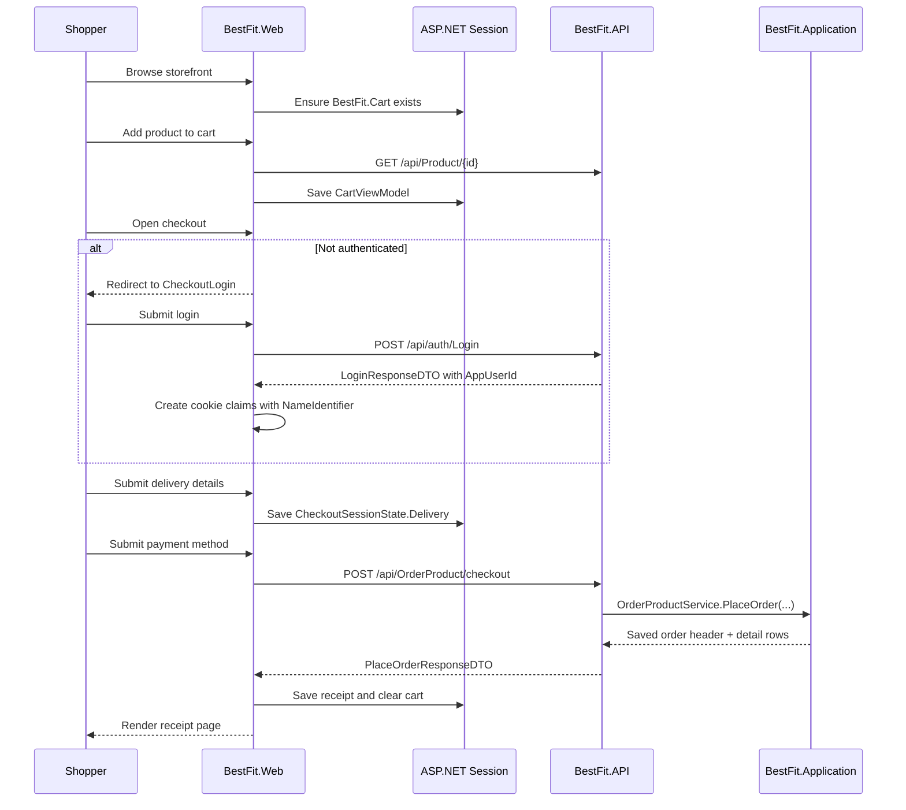

# Guest Cart and Checkout Implementation Guide

## Purpose

This document explains the guest cart and checkout work that was added to the BestFit codebase.

The feature goal was:

- Every storefront visitor should be able to browse products and build a cart without logging in.
- Login should only be required when the shopper actually proceeds into checkout.
- Delivery and payment steps should use the same session-backed cart data end to end.
- Completing checkout should create a real `OrderProduct` record and related `OrderDetails` rows through the API.

This guide is written for a new developer joining the project. It explains what changed, why it changed, where the logic lives, how the request flow works, and what the current limitations are.

## What Changed

At a high level, this work introduced six connected changes:

1. A session-backed cart in the MVC web app.
2. Public shopping flows that no longer require authentication up front.
3. A checkout gate that asks the user to log in only when they move past the cart step.
4. Session-backed checkout state for delivery, payment selection, and the last receipt.
5. A dedicated API checkout endpoint that creates an order and its order-detail rows together.
6. An auth handoff that preserves the real application user id in the web cookie so checkout can attach the order to the logged-in user.

## Why This Design

The original requirement was product-focused rather than infrastructure-focused:

- Shoppers should not be blocked by auth friction while exploring products.
- The cart should feel immediate and persistent within the current browser session.
- The system should only require identity when we need it for a real order.

That requirement pushed the implementation toward a session cart in `BestFit.Web` instead of a database cart in the first pass. Session state is enough to support guest shopping and keeps the change small enough to land without redesigning the full domain model.

## High-Level Architecture

The feature spans three layers:

- `BestFit.Web` owns the guest cart, checkout screens, session state, and the API calls used during checkout.
- `BestFit.API` exposes the checkout endpoint that accepts the final order payload.
- `BestFit.Application` validates and persists the `OrderProduct` header and `OrderDetails` items in one flow.



## End-to-End User Journey

### 1. Visitor lands anywhere in the storefront

The shared layout now injects `SessionCartService` and calls `GetCartAsync()` while rendering the page. That means an empty cart is created lazily for the current browser session even before the user adds anything.

Important effect:

- The header cart count is now live.
- The cart sidebar always has real session state to render.
- The app behaves as though every visitor already has a cart.

### 2. Visitor adds items without logging in

Product cards and product detail pages now link to `CartController.Add`.

That action:

- Accepts either `productId` or `id`.
- Resolves the product from the API when adding a new item.
- Stores a `CartItemViewModel` in session.
- Merges quantity when the same product is added again.
- Redirects back to the originating page using `returnUrl`.
- Sets `TempData["OpenCart"]` so the cart drawer opens after the redirect.

### 3. Visitor reviews the cart

`CheckoutController.Checkout` renders the cart review page using the live session cart. The page supports:

- Quantity updates.
- Item removal.
- Empty-cart state.
- A "Next step" button that starts checkout.

### 4. Login is enforced only at checkout start

`CheckoutController.Start` is the gate between guest browsing and authenticated checkout.

Behavior:

- If the cart is empty, redirect back to the cart page.
- If the user is already logged in, go straight to delivery.
- If the user is not logged in, redirect to `CheckoutLogin`.

This is the main rule change that satisfies the original requirement.

### 5. User logs in and returns to checkout

The login flow was updated so the web app respects `returnUrl`.

This matters because:

- The shopper can be sent to login from checkout.
- After successful login, the app returns them to the correct next page instead of always sending them home.

The login response and authentication cookie were also updated so the web app holds the real `AppUserId`, which is needed when the order is finally created.

### 6. Delivery step stores checkout progress in session

The delivery form posts to `CheckoutController.CheckoutDelivery`.

The controller validates the form and stores:

- `Name`
- `CellPhone`
- `Address`
- `PostalCode`
- `DeliveryMethod`

This data is written into `BestFit.Checkout` session state through `SessionCheckoutService`.

### 7. Payment step uses the same cart and saved delivery data

The payment screen is not a separate order store. It is a projection over:

- The live session cart from `SessionCartService`
- The saved delivery state from `SessionCheckoutService`
- The selected payment method from the current form or prior session state

When the payment form is submitted, the controller:

- Ensures the user is still authenticated.
- Ensures delivery info exists.
- Saves the selected payment method in session.
- Calls `CheckoutOrderService.PlaceOrderAsync(...)`.

### 8. Order is created through the API

`CheckoutOrderService` builds a `PlaceOrderRequestDTO` from:

- The authenticated user id in the cookie claim
- Delivery information from session
- Cart items from session
- The chosen payment method for receipt display

It then calls:

- `POST /api/OrderProduct/checkout`

The API translates the DTO into domain entities and passes them to `OrderProductService.PlaceOrder(...)`.

### 9. Receipt is stored and cart is cleared

On a successful API response, the web app:

- Builds a `CheckoutReceiptViewModel`
- Saves it into checkout session state
- Clears the cart session
- Clears checkout progress but preserves the last receipt
- Redirects to the receipt page

This gives the user a final confirmation page without leaving stale cart contents behind.

## Session Model

### Cart session

Session key:

- `BestFit.Cart`

Stored type:

- `CartViewModel`

Current shape:

```csharp
public class CartViewModel
{
    public Guid CartId { get; set; } = Guid.NewGuid();
    public List<CartItemViewModel> Items { get; set; } = new();

    public bool IsEmpty => Items.Count == 0;
    public int DistinctItemCount => Items.Count;
    public int TotalQuantity => Items.Sum(item => item.Quantity);
    public decimal Subtotal => Items.Sum(item => item.LineTotal);
}
```

Important behaviors:

- The cart is serialized as JSON into ASP.NET session.
- `AddItemAsync` fetches product metadata from the API only when a new product is added.
- Updating an item to quantity `0` removes it.
- `ClearAsync` empties the item list but keeps the cart object alive in session.

### Checkout session

Session key:

- `BestFit.Checkout`

Stored type:

- `CheckoutSessionState`

Current shape:

```csharp
public class CheckoutSessionState
{
    public CheckoutDeliveryViewModel? Delivery { get; set; }
    public string? PaymentMethod { get; set; }
    public CheckoutReceiptViewModel? LastReceipt { get; set; }
}
```

Important behaviors:

- Delivery information is saved after the delivery form succeeds.
- Payment method is saved before order placement.
- Receipt is saved after order placement succeeds.
- `ClearProgress(preserveReceipt: true)` wipes delivery and payment state but keeps the receipt so the confirmation page can still render.

## Route and Controller Reference

### Cart routes in `BestFit.Web`

| Route | Method | Auth required | Responsibility |
| --- | --- | --- | --- |
| `/Cart/Index` | GET | No | Redirects to `/Checkout/Checkout` |
| `/Cart/Add` | GET | No | Adds an item to the session cart and redirects back |
| `/Cart/Update` | POST | No | Updates quantity for an item |
| `/Cart/Remove` | POST | No | Removes an item |
| `/Cart/Clear` | POST | No | Clears the cart |

### Checkout routes in `BestFit.Web`

| Route | Method | Auth required | Responsibility |
| --- | --- | --- | --- |
| `/Checkout/Checkout` | GET | No | Shows the cart review page |
| `/Checkout/Start` | GET | No | Entry gate that decides login vs delivery |
| `/Checkout/CheckoutLogin` | GET | No | Shows "login to continue" page with cart summary |
| `/Checkout/CheckoutDelivery` | GET | Yes | Shows delivery form |
| `/Checkout/CheckoutDelivery` | POST | Yes | Validates and saves delivery info |
| `/Checkout/CheckoutPayment` | GET | Yes | Shows payment choices and order summary |
| `/Checkout/CheckoutPayment` | POST | Yes | Places the order through the API |
| `/Checkout/CheckoutReceipt` | GET | Yes | Shows the last saved receipt |

### Checkout API route in `BestFit.API`

| Route | Method | Responsibility |
| --- | --- | --- |
| `/api/OrderProduct/checkout` | POST | Creates the order header and detail rows from the checkout payload |

## API Contract

### Request DTO

`PlaceOrderRequestDTO`

```json
{
  "appUserId": "string",
  "name": "string",
  "cellPhone": "string",
  "address": "string",
  "postalCode": "string",
  "orderStatus": "Placed",
  "items": [
    {
      "productId": "guid",
      "count": 1,
      "price": 4999.0
    }
  ]
}
```

### Response DTO

`PlaceOrderResponseDTO`

```json
{
  "orderId": "guid",
  "orderDate": "2026-03-12T12:34:56Z",
  "orderPrice": 4999.0,
  "orderStatus": "Placed",
  "cellPhone": "string",
  "address": "string",
  "postalCode": "string",
  "name": "string",
  "appUserId": "string",
  "items": []
}
```

### API-side validation currently enforced

`OrderProductService.PlaceOrder(...)` validates:

- The request has a signed-in user id.
- Delivery fields are present.
- At least one item exists.
- The referenced application user exists.
- Each item has a non-empty product id.
- Each item has a quantity greater than zero.
- Each item has a non-negative price.
- Each referenced product exists.

The service also assigns:

- `OrderProduct.Id`
- `OrderProduct.OrderDate`
- `OrderProduct.OrderStatus` when missing
- `OrderDetails.Id`
- `OrderDetails.OrderProductId`
- `OrderProduct.OrderPrice`

## Auth Handoff Changes

Checkout order creation depends on the application user id, not just the email address.

To support that, the login flow was extended in four places:

1. `LoginResponseDTO` now includes `AppUserId`.
2. `AuthService.Login(...)` now populates that property.
3. `TokenRepository.CreateJWTToken(...)` now includes `ClaimTypes.NameIdentifier` and `ClaimTypes.Name` in the JWT.
4. `AccountController.Login(...)` now writes `ClaimTypes.NameIdentifier` into the web auth cookie.

Without this change, the web layer would know the shopper was authenticated but would not have a stable application user id to attach to the order payload.

## File Map

This section groups the feature-related files by responsibility so a new developer can navigate the code quickly.

### Web layer: cart and checkout behavior

- `src/BestFit.Web/Program.cs`
  Registers session support, `IHttpContextAccessor`, `SessionCartService`, `SessionCheckoutService`, and `CheckoutOrderService`.
- `src/BestFit.Web/Controllers/CartController.cs`
  Owns add, update, remove, and clear actions for the session cart.
- `src/BestFit.Web/Controllers/CheckoutController.cs`
  Owns the cart page, login gate, delivery step, payment step, and receipt step.
- `src/BestFit.Web/Services/SessionCartService.cs`
  Reads and writes `BestFit.Cart` session state and enriches new cart items from the product API.
- `src/BestFit.Web/Services/SessionCheckoutService.cs`
  Reads and writes `BestFit.Checkout` session state.
- `src/BestFit.Web/Services/CheckoutOrderService.cs`
  Builds the checkout API payload and converts the API response into a receipt view model.

### Web layer: cart and checkout models

- `src/BestFit.Web/Models/Cart/CartItemViewModel.cs`
  Represents a single item in the session cart.
- `src/BestFit.Web/Models/Cart/CartViewModel.cs`
  Represents the whole cart and exposes computed totals.
- `src/BestFit.Web/Models/Checkout/CheckoutDeliveryViewModel.cs`
  Represents delivery form input and validation.
- `src/BestFit.Web/Models/Checkout/CheckoutPaymentViewModel.cs`
  Represents payment selection plus the current cart and delivery summary.
- `src/BestFit.Web/Models/Checkout/CheckoutReceiptViewModel.cs`
  Represents the final confirmation page.
- `src/BestFit.Web/Models/Checkout/CheckoutSessionState.cs`
  Represents the JSON payload stored in checkout session state.

### Web layer: UI touchpoints

- `src/BestFit.Web/Views/Shared/_Layout.cshtml`
  Resolves the live cart, updates the cart count in the header, and opens login or cart sidebars through `TempData`.
- `src/BestFit.Web/Views/Shared/CartSidebar.cshtml`
  Renders the real session cart instead of placeholder content.
- `src/BestFit.Web/Views/Checkout/Checkout.cshtml`
  Cart review page with live session data.
- `src/BestFit.Web/Views/Checkout/CheckoutLogin.cshtml`
  Login gate page that explains why the user is being asked to sign in.
- `src/BestFit.Web/Views/Checkout/CheckoutDelivery.cshtml`
  Delivery form.
- `src/BestFit.Web/Views/Checkout/CheckoutPayment.cshtml`
  Payment selection page plus cart and delivery summary.
- `src/BestFit.Web/Views/Checkout/CheckoutReceipt.cshtml`
  Receipt page rendered from the saved receipt view model.
- `src/BestFit.Web/Views/Home/Index.cshtml`
  Product cards now add to cart with a `returnUrl`.
- `src/BestFit.Web/Views/Shop/Index.cshtml`
  Shop grid now adds to cart with a `returnUrl`.
- `src/BestFit.Web/Views/Shop/ListView.cshtml`
  Shop list view now adds to cart with a `returnUrl`.
- `src/BestFit.Web/Views/Product/Index.cshtml`
  Product detail page now adds to cart with a `returnUrl`.

### Web layer: supporting controller changes

- `src/BestFit.Web/Controllers/ShopController.cs`
  No longer requires pre-checkout authentication, so guests can shop.
- `src/BestFit.Web/Controllers/ProductController.cs`
  Accepts either `id` or `productId` so mixed link patterns in the storefront still resolve correctly.
- `src/BestFit.Web/Controllers/AccountController.cs`
  Respects `returnUrl` after login and writes `NameIdentifier` into the cookie claims.

### Shared and API contracts

- `src/BestFit.Shared/DTOs/RequestDTOs/PlaceOrderRequestDTO.cs`
  Request payload for checkout order creation.
- `src/BestFit.Shared/DTOs/RequestDTOs/PlaceOrderItemRequestDTO.cs`
  Request payload for each item in the order.
- `src/BestFit.Shared/DTOs/ResponseDTOs/PlaceOrderResponseDTO.cs`
  Response payload returned after order creation.
- `src/BestFit.Shared/DTOs/ResponseDTOs/LoginResponseDTO.cs`
  Login response now includes `AppUserId`.

### API and application layer

- `src/BestFit.API/Controllers/OrderProductsController.cs`
  Exposes `POST /api/OrderProduct/checkout`.
- `src/BestFit.Application/Services/OrderProductService.cs`
  Validates and persists the order header and detail rows.
- `src/BestFit.Application/Models/Orders/PlaceOrderResult.cs`
  Application result object used to return the created order and items together.
- `src/BestFit.Application/Services/AuthService.cs`
  Populates `AppUserId` in the login response.
- `src/BestFit.Infrastructure/Repositories/TokenRepository.cs`
  Emits the claims needed by the web layer during authenticated checkout.

## Important Implementation Details

### The cart is session-backed, not database-backed

This is intentional for the first version of the feature.

Benefits:

- Simple guest cart support.
- No migration needed for a new persisted cart schema.
- Easy to clear after checkout.

Tradeoff:

- The cart is tied to the current browser session.
- Signing in on another device does not restore the guest cart.
- Session expiration removes the cart.

### Product metadata is copied into the cart at add time

When a new product is added, `SessionCartService` calls the product API and stores:

- Product id
- Name
- Category name
- Image url
- Unit price

This keeps the cart lightweight and display-friendly, but it also means the cart becomes a snapshot of product information at the time the item was added.

### Receipt persistence is also session-backed

The receipt page is rendered from `CheckoutReceiptViewModel` stored in `BestFit.Checkout`.

That means:

- The receipt is available immediately after checkout.
- The receipt is not a query over persisted order history yet.
- If session state is cleared, the receipt page can no longer render from web session alone.

## Manual Smoke Test

A new developer can validate the feature with the following flow:

1. Start the web app and API.
2. Visit the home page as an anonymous user.
3. Confirm the header shows a cart count instead of requiring login.
4. Add a product from the home page, shop page, and product detail page.
5. Confirm each add redirects back to the originating page and opens the cart sidebar.
6. Open the cart page and update quantity for one item.
7. Remove an item and confirm totals update.
8. Click "Next step" from the cart page while logged out.
9. Confirm the app redirects to the login gate instead of blocking shopping earlier.
10. Log in and confirm the app returns to checkout flow rather than sending you home.
11. Submit delivery details and confirm the payment page shows the same cart and delivery summary.
12. Submit a payment method and confirm an order is created.
13. Confirm the receipt page shows the order id, totals, shipping info, and item summary.
14. Confirm the cart is empty after receipt is shown.

## Known Gaps and Future Improvements

The feature is working end to end, but there are several follow-up improvements worth planning.

### 1. Price trust should move server-side

The current checkout payload sends the item price from the session cart to the API, and `OrderProductService.PlaceOrder(...)` uses that price to compute `OrderPrice`.

That is acceptable for a first pass but should be hardened.

Preferred follow-up:

- Look up the authoritative current product price on the server.
- Ignore or validate the client-sent price.

### 2. Payment selection is informational only

The payment page currently captures a payment method string and proceeds directly to order creation.

There is no real integration yet for:

- Card processing
- PayPal authorization
- Bank transfer reconciliation

### 3. Cart merge on login is not implemented

If the team later introduces persisted user carts, the current guest cart will need merge logic when the user signs in.

That logic does not exist yet because the current cart is session-only.

### 4. Inventory or stock validation is not part of checkout yet

The checkout flow validates product existence, but it does not reserve stock or validate inventory quantities.

### 5. Receipt history is not implemented

The final receipt page is powered by session state, not a "view my past orders" feature.

If the project needs order history, the next step would be a dedicated profile or orders page backed by persisted order queries.

## Verification Notes

Build verification in this environment was partially blocked by existing package restore and audit issues.

Observed behavior during verification:

- `BestFit.Shared` built successfully.
- `BestFit.Application`, `BestFit.API`, and `BestFit.Web` reported `0 Error(s)` but still exited non-zero because of existing restore and package warnings.
- Existing warnings included `NU1900` and `NU1701`.
- Some runs also failed to reach `https://api.nuget.org/v3/index.json`, which prevented clean restore and audit checks in the sandboxed environment.

This means the feature changes were checked as far as the current environment allowed, but a clean fully-restored build should still be run in a normal development environment.

## Suggested Next Steps for a New Developer

If you are continuing this work, these are the most sensible follow-up areas:

1. Make pricing server-authoritative during checkout.
2. Add a persisted order-history screen for authenticated users.
3. Introduce real payment-provider integration or at least payment-intent tracking.
4. Decide whether guest carts should remain session-only or eventually merge into a stored user cart.
5. Add automated integration tests around the checkout happy path and auth gating.

## Quick Summary

The storefront now supports guest shopping with a real session cart, requires login only when checkout begins, carries delivery and payment state through session, creates real orders through the API, and ends with a receipt while clearing the cart. The implementation is intentionally lightweight and session-driven, which made it fast to land and easy to reason about, while still leaving clear extension points for server-side pricing, payment integration, and order history.
